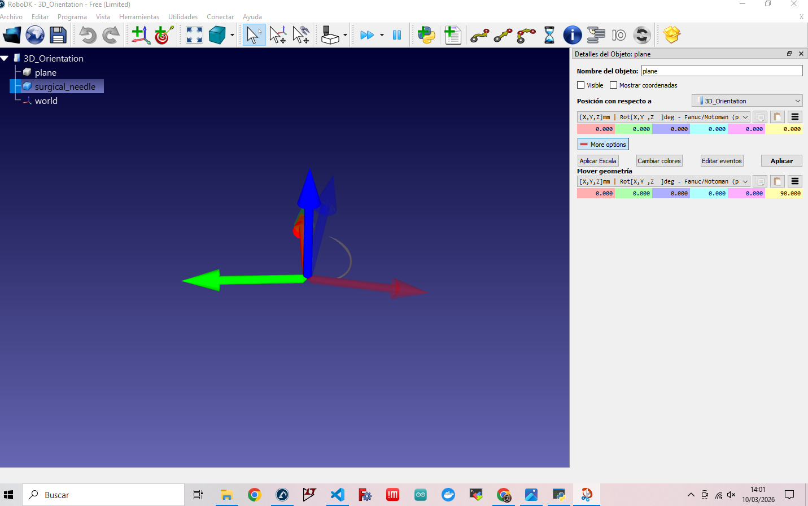
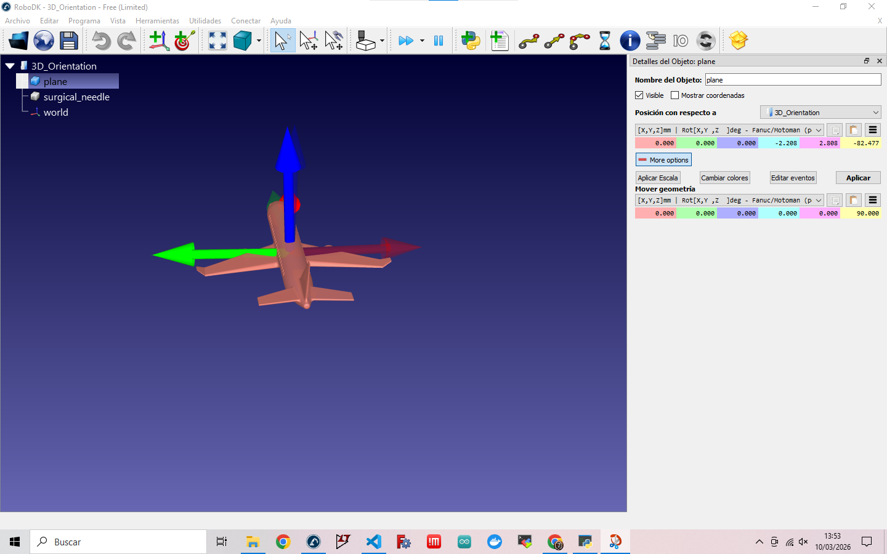
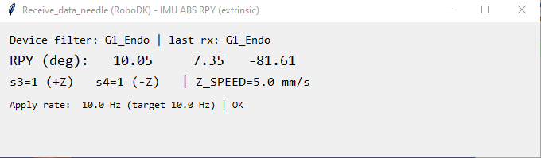

# Laboratory session delivery

## Your first operating performances diagnostic

We first were familiarized with GitHub and Git commands to share a project while keeping backups. A fork of [GEB Projects Tools Repository](https://github.com/manelpuig/GEB_Projects_tools) was done and it was loaded locally using `git clone`. Then in `src\ESP32Test_Blink\src\main.cpp` was compiled and run on the device which made an led blink every second.

## The corrections you have made in the code

### - Change the 3D object orientation to "surgical_needle". What you have to change in the python code?

`src\ESP32Test_Blink\src\main.cpp` MENCIONAR A QUIN FILE HEM MODIFICAT D AQUESTA MANERA 

### - Make the necessary corrections in the code and verify the correct orientation in roboDK virtual environment.

## Your final conclusions

In this lab, we explored GitHub and Git programs, which facilitate sharing versions of a digital project across participants. We also got familiarized with the PlatformIO IDE extension, which enabled us to program the ESP32 device as a sensor of 3D orientation. We did find a bug that the device was not in download mode, which was solved by holding the restart button and connecting again to the computer. Throughout the sensor experiment, we used a local network provided by the supervisors so that the microcontroller could send data wirelessly into the `3D_Orientation.rdk`, which was in the computer.

### Is the orientation correct? why or why not?

